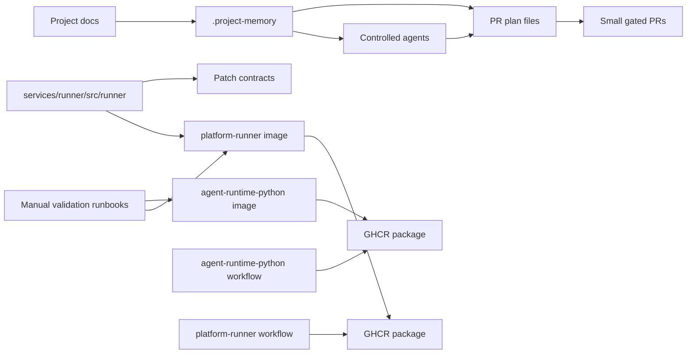

# Current Project Map

## Checkpoint purpose

This document is a **documentation checkpoint** after PRs 0001–0009. It maps
what is actually implemented in the repository, compares it against existing
project documentation, separates implemented from aspirational content, and
identifies next sensible tracks — without starting new implementation.

## Current artifact inventory

### Repository / control artifacts

| Artifact | Status |
|----------|--------|
| `README.md` | implemented |
| `docs/START_HERE.md` | implemented |
| `docs/REPOSITORY_STRUCTURE.md` | implemented |
| `docs/DEVELOPMENT_ORDER.md` | implemented |
| `docs/AGENTS.md` | implemented |
| `docs/DEVELOPER_PACK.md` | implemented |
| `docs/architecture/CONTROL_PLANES.md` | implemented |
| `docs/adr/0001-repository-skeleton-first.md` | implemented |
| `docs/adr/0002-container-build-strategy.md` | implemented |
| `docs/sprints/SPRINT_0_REPOSITORY_SKELETON.md` | implemented |
| `docs/sprints/SPRINT_1_RUNNER_PATCH_PIPELINE.md` | implemented |
| `.project-memory/memory_index.yml` | implemented |
| `.project-memory/project_contract.yml` | implemented |
| `.project-memory/anchors.yml` | implemented |
| `.project-memory/context-bundles/` (5 bundles) | implemented |
| `agents/*.yml` (4 Docker Agent configs) | implemented |
| `.project-memory/pr/0001-runner-patch-contracts/PLAN.md` | implemented |
| `.project-memory/pr/0002-container-build-strategy/PLAN.md` | implemented |
| `.project-memory/pr/0003-agent-runtime-python-image/PLAN.md` | implemented |
| `.project-memory/pr/0004-ghcr-agent-runtime-python-workflow/PLAN.md` | implemented |
| `.project-memory/pr/0005-local-manual-image-validation/PLAN.md` | implemented |
| `.project-memory/pr/0006-platform-runner-image/PLAN.md` | implemented |
| `.project-memory/pr/0007-platform-runner-local-manual-validation/PLAN.md` | implemented |
| `.project-memory/pr/0008-github-actions-node24-compat/PLAN.md` | implemented |
| `.project-memory/pr/0009-platform-runner-ghcr-workflow/PLAN.md` | implemented |
| `.project-memory/pr/0010-architecture-checkpoint/PLAN.md` | implemented |
| CI workflow (`.github/workflows/ci.yml`) | implemented |

### Runner / contracts

| Artifact | Status |
|----------|--------|
| `services/runner/src/runner/__init__.py` | implemented |
| `services/runner/src/runner/models.py` | implemented (RunSpec, CommandSpec, PatchFile, NormalizedPatch, RunResult, RunArtifact) |
| `services/runner/src/runner/patch.py` | implemented (normalize_repo_path, is_forbidden_patch_path, validate_patch_path, normalize_patch_text) |
| `services/runner/tests/test_runner_models.py` | implemented (8 tests) |
| `services/runner/tests/test_patch_normalizer.py` | implemented (39 tests) |
| `services/runner/tests/test_sandbox_paths.py` | implemented (7 tests) |

### Docker images

| Image | Status |
|-------|--------|
| `docker/agent-runtime-python` | implemented |
| `docker/platform-runner` | implemented |

### GHCR workflows

| Workflow | Status |
|----------|--------|
| `.github/workflows/agent-runtime-python-image.yml` | implemented (Node 24 compatible) |
| `.github/workflows/platform-runner-image.yml` | implemented (Node 24 compatible) |

### Runbooks

| Runbook | Status |
|---------|--------|
| `docs/runbooks/agent-runtime-python-local-validation.md` | implemented |
| `docs/runbooks/platform-runner-local-validation.md` | implemented |

## Current container artifacts: 2

Two container images are defined in the repository, both with GHCR publishing
workflows and manual validation runbooks:

1. **`agent-runtime-python`** — Minimal Python base image for controlled Docker
   Agents. Includes Python 3.12, pip, git, ca-certificates, and a non-root
   `agent` user (UID 10001). Does not include platform service code.
   Published as `ghcr.io/<org>/ariadne/agent-runtime-python`.

2. **`platform-runner`** — Platform runner service image. Packages
   `services/runner/src/runner` into `/app/runner` with `PYTHONPATH=/app`.
   Non-root `runner` user (UID 10002). Import-only placeholder command.
   Published as `ghcr.io/<org>/ariadne/platform-runner`.

## Current architecture diagram

## PR timeline

| PR | Name | Implemented outcome | Status |
|----|------|---------------------|--------|
| 0001 | Runner Patch Contracts | Runner models (RunSpec, NormalizedPatch, etc.), path validation, forbidden path rejection, unified-diff parsing, sandbox path tests | implemented |
| 0002 | Container Build Strategy | ADR 0002 documenting image strategy, registry policy, security constraints, future PR sequence | implemented |
| 0003 | Agent Runtime Python Image | `docker/agent-runtime-python` Dockerfile, .dockerignore, README | implemented |
| 0004 | GHCR Agent Runtime Python Workflow | `.github/workflows/agent-runtime-python-image.yml` with PR build and GHCR publish | implemented |
| 0005 | Local Manual Image Validation | `docs/runbooks/agent-runtime-python-local-validation.md` | implemented |
| 0006 | Platform Runner Service Image | `docker/platform-runner` Dockerfile, .dockerignore, README | implemented |
| 0007 | Platform Runner Local Manual Validation | `docs/runbooks/platform-runner-local-validation.md` | implemented |
| 0008 | GitHub Actions Node 24 Compatibility | Action version bumps to Node 24-compatible majors | implemented |
| 0009 | Platform Runner GHCR Workflow | `.github/workflows/platform-runner-image.yml` with PR build and GHCR publish | implemented |
| 0010 | Architecture Checkpoint | This document | implemented |

## Documentation alignment

| Area | What docs appear to say | Current implementation | Status | Notes |
|------|------------------------|-----------------------|--------|-------|
| Controlled agent model | 4 agents with configs and memory | `agents/*.yml`, `.project-memory/` exist | implemented | |
| PR plan discipline | Small gated PRs with PLAN.md | 10 PR plan directories | implemented | |
| Runner patch contracts | Path validation, forbidden paths, diff parsing | `patch.py`, `models.py`, 54 tests | implemented | |
| agent-runtime-python image | Generic agent runtime base | Dockerfile, .dockerignore, README, workflow, runbook | implemented | Node 24 compatible |
| platform-runner image | Platform service image | Dockerfile, .dockerignore, README, workflow, runbook | implemented | Build context `.` with Dockerfile.dockerignore |
| GHCR publishing | GITHUB_TOKEN only, ghcr-publish environment | Both workflows use ghcr-publish, GITHUB_TOKEN | implemented | |
| No Docker Hub / Artifactory / PATs | ADR 0002 constraint | Not present in any workflow | implemented | |
| No `latest` / floating `main` | ADR 0002 and PR 0004 plan | Not present in any workflow | implemented | |
| Task intake service | POST /task-intake/normalize, task draft | `services/task_intake/` exists but no production API | planned | |
| Core service | Repository scanner, symbol nodes, task subgraph | `services/core/` exists, placeholder only | planned | |
| Conductor service | Run state machine, DAG validator, approval gates | `services/conductor/` exists, placeholder only | planned | |
| Model gateway | Policy routing, usage recording | `services/model_gateway/` exists, placeholder only | planned | |
| Frontend | New Task screen, run progress, diff/artifacts | `apps/web/` exists, placeholder only | planned | |
| docker-compose | Local development compose | Not created (deferred to PR 0006 in ADR 0002) | planned | |
| Multi-arch builds | Deferred in ADR 0002 | Not implemented | planned | |
| Image signing / attestation | Required before production release (ADR 0002) | Not implemented | planned | |
| Shared packages (common, policy, contracts) | Listed in REPOSITORY_STRUCTURE.md | `packages/` dirs exist, mostly empty | partially implemented | `packages/policy/src/__init__.py` exists |

## Implemented vs planned

### Implemented now

- Repository skeleton with service placeholder directories
- 4 controlled Docker Agent configs with shared memory
- PR plan discipline (10 PRs with PLAN.md files)
- Runner patch contracts (`models.py`, `patch.py`, 54 tests)
- 2 Docker images (`agent-runtime-python`, `platform-runner`)
- 2 GHCR workflows (non-publishing PR builds, ghcr-publish gated publish)
- 2 manual validation runbooks
- Node 24-compatible action versions
- Container build strategy ADR
- Architecture checkpoint

### Partially implemented

- Shared packages (`packages/policy` has `__init__.py`, others are empty)
- CI workflow (runs pytest + compileall, no editable monorepo install)

### Planned / aspirational

- Task intake service functionality
- Core service (repository scanner, subgraph)
- Conductor service (run state machine, approval gates)
- Model gateway service
- Frontend web app
- docker-compose for local dev
- Multi-arch builds
- Image signing / attestation
- Real runner entrypoint beyond import-only
- Runner CLI / doctor command

### Not started

- Agent runtime execution inside sandboxes
- Patch application to canonical repository
- Authorization / approval UI
- Voice input processing
- Production deployment
- Kubernetes manifests

## Drift / risk notes

### Build context nuance

The `platform-runner` Dockerfile `COPY` references `services/runner/src/runner`,
which is outside the `docker/platform-runner` subdirectory. This required
changing the workflow build context from scoped (`docker/platform-runner`) to
repository root (`.`), and adding `Dockerfile.dockerignore` to keep the context
minimal. This pattern is now canonical for images that COPY from the monorepo.

### Cold-read reviews

Because multiple PRs in this sequence are structurally similar (Dockerfile,
workflow, runbook), reviewers must use a cold-read protocol — read from the
filesystem, not from memory — to avoid approving structural drift.

### Runner image depth

The `platform-runner` image currently validates only that `import runner`
succeeds. It does not run a real service, expose ports, or execute agent
workloads. The image is import-ready, not production-ready.

### Additional images

More service images (core, conductor, task-intake, model-gateway) should not
be added until the corresponding component has a stable enough API surface
to justify a separate runtime container.

### Docs vs implementation

Several documents (especially `docs/DEVELOPMENT_ORDER.md` and
`docs/START_HERE.md`) describe phases that include full service
implementations (Task Intake, Core, Conductor, Frontend) that have not been
started outside of placeholder directories. The docs are aspirational — they
describe what the platform *will* do, not what it currently does. This is
appropriate for a pre-MVP project, but the gap between docs and implementation
should be acknowledged.

## Recommended next tracks

1. **Runner CLI or doctor command** — Add a `runner doctor` or `runner check`
   entrypoint to the runner image that exercises more than import, e.g.
   validating that path normalization works end to end.

2. **Test CI improvement** — Currently CI installs only `pytest` via pip.
   Consider whether service-level tests should run in isolated environments or
   if the current flat pytest approach is sufficient.

3. **Documentation alignment pass** — Update or add a note in
   `docs/DEVELOPMENT_ORDER.md` and `docs/START_HERE.md` acknowledging which
   services are placeholders vs implemented. Keep the aspirational content
   but label it clearly.

4. **Container release contract** — Create the docs-only contract proposed in
   PR 0010 (container release contract variant) to formalize patterns discovered
   during PR 0004–0009.

5. **Only then consider additional images** — Do not add core, conductor,
   task-intake, or model-gateway images until the corresponding service has a
   stable interface worth containerizing.

## Non-decisions

This document does not decide:

- New Docker images beyond the two existing ones
- New deployment model (Kubernetes, Nomad, etc.)
- Multi-architecture build strategy
- Image signing or attestation tooling
- Vulnerability scanning implementation
- Product API shape
- Frontend architecture
- Voice input pipeline
- Authorization model beyond ADR 0002
- Real runner entrypoint beyond import placeholder

## Approval / review note

- This document requires maintainer review
- Architecture-sensitive claims require architecture reviewer or maintainer
  review
- Claims in this document should be backed by filesystem evidence
- Reviewers must use cold-read protocol: read from filesystem, quote exact
  snippets, list files actually read in CONTEXT USED
